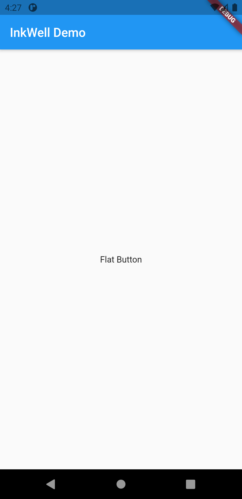

# ripple_effect

A new Flutter project.

Widgets that follow the Material Design guidelines display a ripple animation when tapped.

Flutter provides the InkWell widget to perform this effect. Create a ripple effect using the following steps:

Create a widget that supports tap.
Wrap it in an InkWell widget to manage tap callbacks and ripple animations.

<table>
  <tr>
    <td>First</td>
     <td>Second</td>
  </tr>
  <tr>
    <td></td>
    <td></td>
 
  </tr>
 </table>